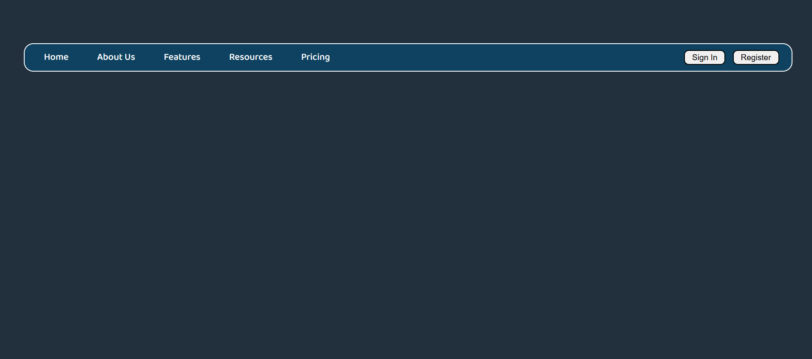

# Simple Navbar Design

A clean and modern **navigation bar UI** built using **HTML and CSS**.  
This project demonstrates a simple website header layout with static navigation links and buttons.

## 🚀 Live Repository
🔗 https://github.com/omkarpawar2002/simple-navbar-design

---

## 📌 Features
- Clean UI
- Sign In and Register buttons
- Built using pure HTML and CSS
- Beginner-friendly project

---

## 🛠️ Technologies Used
- HTML5
- CSS3

---

## 📷 Screenshot



---

## 📂 Project Structure
```
simple-navbar-design
│
├── index.html
├── style.css
├── README.md
│
└── screenshot
    └── navbar.png
```

---

## 🎯 Purpose of This Project
This project was created to practice **HTML and CSS layout design** and understand how navigation bars are structured in modern websites.

---

## 👨‍💻 Author
**Omkar Pawar**

GitHub: https://github.com/omkarpawar2002